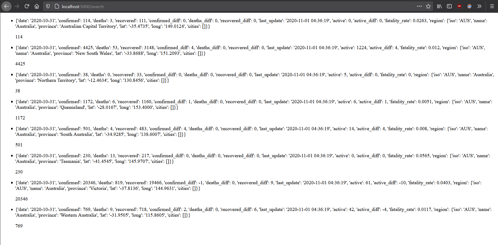

# HackMelbourne Flask workshop code snippets
Here is the final main.py which was seen at the end of the workshop held on 28/8/2020. With the Workshop being archived on Youtube [here](https://youtu.be/xgwvtTH-p0s), where the other workshops can be found [here](https://www.youtube.com/playlist?list=PL42AtWaeQaLkV5mh9od3ArRO1S6ptvJHR).
The actual "ideal" final end product can be seen in the folder "final_product_kinda" as a rough guide on the 3rd task during the workshop.

The final product uses Covid data from [```https://covid-api.com/```](https://covid-api.com/), which sources their data from Johns Hopkins CSSE [```https://github.com/CSSEGISandData/COVID-19```](https://github.com/CSSEGISandData/COVID-19). This was chosen as the API is well documented and easily accessible for first timers.

Feel free to clone this project and build upon it ;)

Built using Python3.8 but should work for 3.6+. And with the lovely help from PyCharm.

## Requirements:
- Flask
- requests

## Preview Image:
A possible final product, showing covid data for Australia. Lots of possibilities for expansion.

